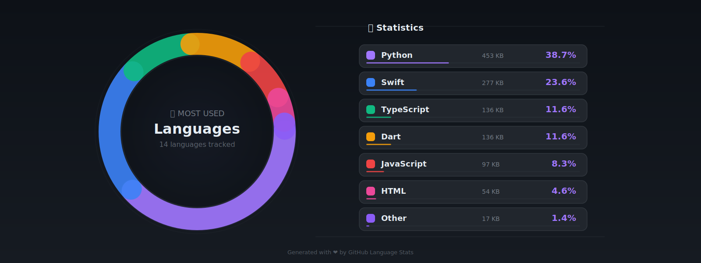

<p align="center">
  
</p>

<p align="center">
  
</p>

<!-- Animated Line -->
<p align="center">
  
</p>

<p align="center">
  <a href="https://t.me/n1x9s"></a>
  <a href="https://instagram.com/n1x9s"></a>
  <a href="https://linkedin.com/in/n1x9s"></a>
  <a href="https://x.com/n1x9s"></a>
</p>

<p align="center">
  
  
</p>

<!-- About Me Section -->


<h2 align="center">
   About Me
</h2>


```python
class SoftwareEngineer:
    def __init__(self):
        self.name = "Nikita"
        self.age = 20
        self.location = "Moscow, Russia"
        self.role = "Backend Developer"

    @property
    def skills(self):
        return {
            "languages": ["Python", "Go", "C++", "JS"],
            "frameworks": ["FastAPI", "Django", "Flask"],
            "databases": ["PostgreSQL", "Redis", "SQLite"],
            "devops": ["Docker", "Nginx", "Linux"],
            "currently_learning": ["Kubernetes", "gRPC"]
        }

    def say_hi(self):
        print("Thanks for dropping by! Let's build"
              " something amazing together!")

me = SoftwareEngineer()
me.say_hi()
```

<br clear="both"/>

<!-- Tech Stack Section -->


<h2 align="center">
   Tech Stack
</h2>

<h3 align="center">Languages</h3>
<p align="center">
  
  
  
  
</p>

<h3 align="center">Backend & Frameworks</h3>
<p align="center">
  
  
  
  
</p>

<h3 align="center">Databases</h3>
<p align="center">
  
  
  
</p>

<h3 align="center">DevOps & Cloud</h3>
<p align="center">
  
  
  
</p>

<h3 align="center">Tools & Others</h3>
<p align="center">
  
  
  
  
</p>

<!-- Language Analytics Section -->


<h2 align="center">
   Language Analytics
</h2>

<p align="center">
  
</p>

<!-- Activity Graph Section -->


<h2 align="center">
   Contribution Graph
</h2>

<p align="center">
  
</p>

<!-- Snake Animation -->
<p align="center">
  <picture>
    <source media="(prefers-color-scheme: dark)" srcset="https://raw.githubusercontent.com/n1x9s/n1x9s/output/github-snake-white.svg">
    <source media="(prefers-color-scheme: light)" srcset="https://raw.githubusercontent.com/n1x9s/n1x9s/output/github-snake-white.svg">
    
  </picture>
</p>

<!-- Projects Section -->


<h2 align="center">
   Current Projects
</h2>

<div align="center">

| Project | Description | Tech |
|:-------:|:-----------:|:----:|
| **Continental Custom** | Delivery platform with Telegram Mini App |   |
| **Butter Club** | E-commerce platform for products |   |
| **Microservices Migration** | Transforming monolithic apps |   |

</div>

<!-- Goals Section -->


<h2 align="center">
   2025 Goals
</h2>

<p align="center">
  <br><br>
  <br><br>
</p>

<!-- Quote Section -->
<p align="center">
  
</p>

<!-- Footer -->


<p align="center">
  
</p>

<p align="center">
  <a href="https://github.com/n1x9s">
    
  </a>
</p>


