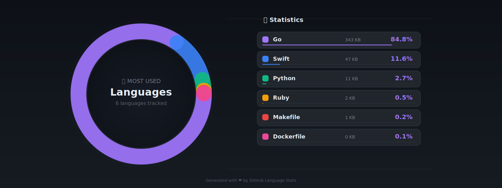

<p align="center">
  
</p>

<p align="center">
  
</p>

<!-- Animated Line -->
<p align="center">
  
</p>

<p align="center">
  <a href="https://t.me/n1x9s"></a>
  <a href="https://instagram.com/n1x9s"></a>
  <a href="https://linkedin.com/in/n1x9s"></a>
  <a href="https://x.com/n1x9s"></a>
</p>

<p align="center">
  
  
</p>

<!-- About Me Section -->


<h2 align="center">
   About Me
</h2>


```go
package main

import "fmt"

type SoftwareEngineer struct {
	Name     string
	Age      int
	Location string
	Role     string
}

func (e *SoftwareEngineer) Skills() map[string][]string {
	return map[string][]string{
		"languages":  {"Go", "C++", "Python", "JS"},
		"frameworks": {"Gin", "Echo", "Fiber", "REST API"},
		"databases":  {"PostgreSQL", "Redis", "MongoDB"},
		"devops":     {"Docker", "Docker Compose", "Nginx", "Linux"},
		"learning":   {"Kafka", "ClickHouse"},
	}
}

func main() {
	me := &SoftwareEngineer{
		Name:     "Nikita",
		Age:      21,
		Location: "Moscow, Russia",
		Role:     "Backend Developer",
	}
	fmt.Println("Thanks for dropping by! " +
		"Let's build something amazing together!")
	_ = me
}
```

<br clear="both"/>

<!-- Tech Stack Section -->


<h2 align="center">
   Tech Stack
</h2>

<h3 align="center">Languages</h3>
<p align="center">
  
  
  
  
</p>

<h3 align="center">Backend & Frameworks</h3>
<p align="center">
  
  
  
  
</p>

<h3 align="center">Databases</h3>
<p align="center">
  
  
  
</p>

<h3 align="center">DevOps & Cloud</h3>
<p align="center">
  
  
  
  
</p>

<h3 align="center">Tools & Others</h3>
<p align="center">
  
  
  
  
</p>

<!-- Language Analytics Section -->


<h2 align="center">
   Language Analytics
</h2>

<p align="center">
  
</p>

<!-- Activity Graph Section -->


<h2 align="center">
   Contribution Graph
</h2>

<p align="center">
  
</p>

<!-- Snake Animation -->
<p align="center">
  <picture>
    <source media="(prefers-color-scheme: dark)" srcset="https://raw.githubusercontent.com/n1x9s/n1x9s/output/github-snake-white.svg">
    <source media="(prefers-color-scheme: light)" srcset="https://raw.githubusercontent.com/n1x9s/n1x9s/output/github-snake-white.svg">
    
  </picture>
</p>

<!-- Projects Section -->


<h2 align="center">
   Current Projects
</h2>

<div align="center">

| Project | Description | Tech |
|:-------:|:-----------:|:----:|
| **Continental Custom** | Delivery platform with Telegram Mini App |   |
| **Butter Club** | E-commerce platform for products |   |
| **Microservices Platform** | High-performance distributed services |   |

</div>

<!-- Goals Section -->


<h2 align="center">
   2025 Goals
</h2>

<p align="center">
  <br><br>
  <br><br>
</p>

<!-- Quote Section -->
<p align="center">
  
</p>

<!-- Footer -->


<p align="center">
  
</p>

<p align="center">
  <a href="https://github.com/n1x9s">
    
  </a>
</p>


